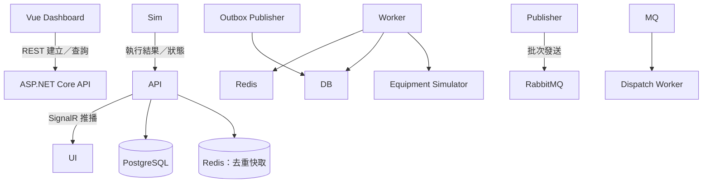
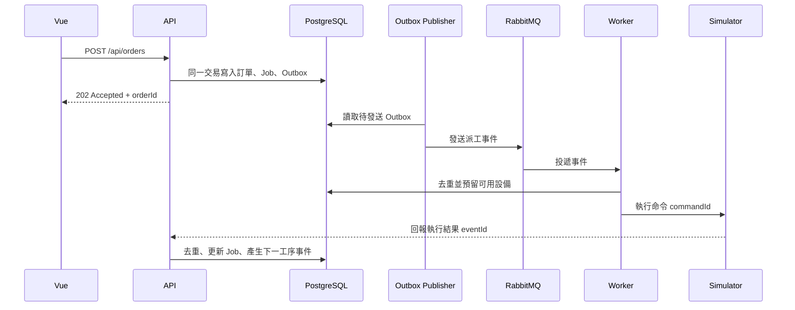

# MiniFactory

**純軟體智慧工廠任務調度與異常監控平台｜Side Project 規格與開發計畫**

> 專案狀態：規劃中。本文是預計實作的規格；下列功能、畫面、部署及測試尚未宣稱完成。開發時會持續更新進度與實際執行方式。

MiniFactory 用虛擬產線與設備模擬製造現場，讓我能在沒有 PLC、機台或攝影機的條件下，實作生產訂單、工序派工、設備回報、故障恢復與系統監控。重點是展示 ASP.NET Core 後端、資料庫、訊息處理及 Vue 前端如何一起處理真實的軟體工程問題。

## 

> 用程式模擬設備，建立一個縮小版的生產派工系統。除了訂單與設備畫面，處理 API 逾時後重送、重複訊息、兩個 Worker 搶同一台設備，以及資料庫寫入成功但訊息發送失敗等情況。Demo 可以現場讓設備離線，再觀察訂單、告警、恢復流程和 Trace。

這是一個**軟體模擬與工程展示專案**，不宣稱已連接真實工廠設備，也不把它當成完整 MES。

## 使用情境

建立訂單 `ORD-20260921-001`，產品 `Motor-A`、數量 500，指定 `Line-01`。第一版將一張訂單簡化為三道依序執行的批次工序：

|順序|工序|虛擬設備|預期流程|
|-|-|-|-|
|1|加工|Machine-A|完成後開放下一道工序|
|2|組裝|Machine-B|完成後開放下一道工序|
|3|檢驗|Machine-C|完成後結束訂單|

Simulator 可以控制設備正常完成、延遲、回傳錯誤、暫時離線及恢復上線。數量 500 是訂單的批次數量；第一版不模擬 500 件產品各自的物料流轉。

## 第一版要完成什麼

* 建立訂單，依固定工序產生 Job，依順序派工。
* 提供 3 台以上的虛擬設備，回報 `Idle`、`Running`、`Error`、`Offline`。
* 保存訂單、Job、執行紀錄、設備狀態歷史、事件及告警。
* 透過 RabbitMQ 傳遞派工事件，由 Worker 處理；使用 Outbox 避免訂單已寫入卻漏送事件。
* 重送派工命令時沿用同一識別碼，防止 Simulator 執行第二次。
* Vue Dashboard 顯示訂單進度、設備狀態及告警；即時更新改採 SignalR 推播為主，輪詢僅作為斷線時的 fallback。
* 用 Docker Compose 啟動 API、Worker、Simulator、Vue、PostgreSQL、RabbitMQ 和 Redis。
* 加入結構化日誌、關聯 ID 與基本 Trace，能追查一筆訂單的處理過程。

Kubernetes、Grafana 完整儀表板、壓測比較與 AI 異常分析屬於第二版；不影響第一版的完成判定。

## 架構



|元件|預計職責|
|-|-|
|Vue 3 + TypeScript|訂單、設備、告警與執行歷史的操作及展示|
|ASP.NET Core Web API|驗證輸入、建立訂單、接收設備回報、提供查詢 API、推播 SignalR 事件|
|SignalR Hub|訂單、設備、告警狀態即時推播給前端；單一實例先不需 Backplane，多實例部署（第二版）時接 Redis Backplane|
|ASP.NET Core Worker|消費派工訊息、執行狀態轉移與逾時檢查、Redis 去重前置檢查|
|PostgreSQL + EF Core|持久資料、唯一約束、交易及 Outbox／Inbox 紀錄|
|RabbitMQ|傳送派工及狀態事件；消費者需容忍重複投遞|
|Redis|`eventId`／`commandId` 去重快取（降低高流量下的 DB 負載）、設備狀態快取；不是唯一的正確性依據，DB 唯一約束才是最終保證|
|Equipment Simulator|以軟體模擬設備回應、故障與命令去重|
|OpenTelemetry|串接 API、Worker 與 Simulator 的 Trace|

### 前端細節

* **狀態管理：** Pinia，依模組拆成 `orders`、`equipment`、`alerts` store；查詢結果快取於 store，避免每次切換頁籤都重打 API。
* **路由：** Vue Router，`/orders`、`/orders/:id`、`/equipment`、`/alerts` 四個主要頁面；訂單詳情頁內嵌事件時間線元件。
* **即時更新：** 主要透過 SignalR 接收 `OrderUpdated`、`EquipmentStatusChanged`、`AlertRaised` 等推播事件更新 store，取代逐頁輪詢打 API。SignalR 斷線時自動以指數退避重連，重連期間退回輪詢作為 fallback（訂單詳情頁 3 秒、告警列表 5 秒），並在畫面提示「即時連線中斷，改用輪詢更新」。分頁不可見時（`document.visibilitychange`）兩種更新方式皆暫停，避免無謂請求。
* **錯誤與告警呈現：** API 錯誤（見下方錯誤格式）統一由 Axios 攔截器轉成 Toast 提示；告警依 `severity` 用不同顏色標示，未處理告警在導覽列顯示未讀數。
* **時區：** 後端一律回傳 UTC，前端用瀏覽器時區格式化顯示，不做伺服器端時區轉換。

### 一筆訂單的流程



## 資料模型草案

|資料表|主要欄位與用途|
|-|-|
|`production\_orders`|`id`, `order\_no`（唯一）, `product\_code`, `quantity`, `line\_id`, `status`, `created\_at`|
|`production\_jobs`|`id`, `order\_id`, `sequence`, `operation`, `status`, `assigned\_equipment\_id`, `version`；`(order\_id, sequence)` 唯一|
|`job\_executions`|`id`, `job\_id`, `attempt\_no`, `command\_id`（唯一）, `status`, `started\_at`, `completed\_at`, `error\_code`|
|`equipment`|`id`, `line\_id`, `name`, `capability`, `status`, `last\_seen\_at`, `version`|
|`equipment\_status\_history`|`id`, `equipment\_id`, `from\_status`, `to\_status`, `occurred\_at`|
|`order\_events`|`id`, `order\_id`, `event\_type`, `payload`, `occurred\_at`|
|`alerts`|`id`, `order\_id`, `equipment\_id`, `severity`, `reason`, `status`, `created\_at`|
|`outbox\_messages`|`id`, `event\_type`, `payload`, `occurred\_at`, `published\_at`, `attempt\_count`|
|`inbox\_messages`|`consumer\_name`, `message\_id`, `processed\_at`；同一消費者和訊息 ID 唯一|
|`simulator\_commands`|`command\_id`（唯一）, `equipment\_id`, `result`, `status`；保存已接受命令與結果|

時間統一以 UTC 儲存，前端依使用者時區顯示。資料表與欄位會在實作遷移檔時定稿。

### 實體關聯（ER 圖）

```mermaid
erDiagram
    production\_orders ||--o{ production\_jobs : "包含"
    production\_jobs ||--o{ job\_executions : "產生"
    production\_jobs }o--|| equipment : "指派給"
    equipment ||--o{ equipment\_status\_history : "記錄"
    equipment ||--o{ simulator\_commands : "接收"
    job\_executions ||--|| simulator\_commands : "對應 command\_id"
    production\_orders ||--o{ order\_events : "產生"
    production\_orders ||--o{ alerts : "觸發"
    equipment ||--o{ alerts : "觸發"
```

`job\_executions.command\_id` 與 `simulator\_commands.command\_id` 一對一對應，是逾時重送與對帳的關鍵鍵值；`production\_jobs.assigned\_equipment\_id` 在設備被預留時寫入，完成或釋放後清空。

### 事件與訊息 Payload Schema

`order\_events.event\_type` 與 Outbox／RabbitMQ 訊息共用同一組事件型別，初版規劃如下（欄位可能在實作時微調，但型別與版本策略固定）：

|`event\_type`|觸發時機|主要 payload 欄位|
|-|-|-|
|`OrderCreated`|訂單建立成功|`orderId`, `orderNo`, `jobIds\[]`|
|`JobDispatchRequested`|Job 排入派工佇列|`jobId`, `equipmentId`, `commandId`, `attemptNo`|
|`JobStarted`|Simulator 確認開始執行|`jobId`, `commandId`, `startedAt`|
|`JobCompleted`|工序執行成功|`jobId`, `commandId`, `completedAt`, `nextJobId`|
|`JobFailed`|工序執行失敗或逾時後確認失敗|`jobId`, `commandId`, `errorCode`, `attemptNo`|
|`EquipmentStatusChanged`|設備狀態轉換|`equipmentId`, `fromStatus`, `toStatus`, `occurredAt`|
|`AlertRaised`|告警建立|`alertId`, `severity`, `reason`, `relatedOrderId`, `relatedEquipmentId`|

共同規則：

* 每個訊息附 `eventId`（去重用）、`eventType`、`eventVersion`（初版固定為 `1`）、`occurredAt`（UTC）。
* Schema 演進採**只加欄位、不刪不改型別**的相容策略；有破壞性變更才調高 `eventVersion`，消費端依版本號分流處理。
* `payload` 在資料庫中以 JSONB 儲存，方便日後查詢但不建立強制 schema 約束，格式正確性由發送端（API／Worker）負責。

## API 草案

|方法|路徑|用途|
|-|-|-|
|`POST`|`/api/orders`|建立訂單；支援 `Idempotency-Key`|
|`GET`|`/api/orders/{id}`|查詢訂單與各工序進度|
|`GET`|`/api/orders/{id}/events`|查詢事件時間線|
|`GET`|`/api/equipment`|查詢設備目前狀態與最後回報時間|
|`GET`|`/api/alerts`|查詢未處理／歷史告警|
|`POST`|`/api/simulator/equipment/{id}/scenario`|在本機 Demo 設定延遲、錯誤或離線情境|
|`POST`|`/api/equipment-events`|接收 Simulator 結果，依 `eventId` 去重|

建立訂單的請求範例：

```http
POST /api/orders
Idempotency-Key: create-order-ord-20260921-001
Content-Type: application/json

{
  "orderNo": "ORD-20260921-001",
  "productCode": "Motor-A",
  "quantity": 500,
  "lineId": "Line-01"
}
```

上述路徑及格式是設計草案，不代表 API 已上線。開發完成後會在此補上 OpenAPI 位置、實際回應與錯誤碼。

### 認證與授權

Demo 環境為求現場操作方便，第一版**不接使用者登入系統**，這是刻意的範圍取捨而非疏漏：

* 所有 `GET` 查詢端點對區網內請求開放，不需認證，方便面試現場直接展示 Dashboard。
* 會修改狀態的端點（`POST /api/orders`、`POST /api/simulator/equipment/{id}/scenario`、`POST /api/equipment-events`）以一組固定的 API Key（`X-Api-Key` Header）做最低限度保護，Key 存於環境變數，不落版控。
* `POST /api/equipment-events` 額外限制只接受來自 Simulator 容器所在網段的請求，降低外部誤打的風險。
* 若要展示企業場景，第二版規劃加上 JWT Bearer Token（角色分：`Operator` 可建單、`Viewer` 唯讀、`Admin` 可操作 Simulator 情境），並將 Simulator 情境端點限制在非 Production 環境才可呼叫。

此設計會在 Demo 開場口頭說明，避免被誤認為「沒考慮過認證」。

### API 錯誤處理規範

所有端點的錯誤回應統一格式（[RFC 9457 Problem Details](https://www.rfc-editor.org/rfc/rfc9457)）：

```json
{
  "type": "https://minifactory.dev/errors/idempotency-conflict",
  "title": "Idempotency key reused with different payload",
  "status": 409,
  "detail": "Idempotency-Key 'create-order-ord-20260921-001' 已存在但內容不同",
  "traceId": "00-4bf92f...-b7ad6b7...-01"
}
```

|狀況|HTTP 狀態碼|說明|
|-|-|-|
|請求參數驗證失敗（如 `quantity <= 0`）|`400 Bad Request`|`errors` 欄位列出各欄位的驗證訊息（沿用 ASP.NET Core `ValidationProblemDetails`）|
|找不到資源（如訂單不存在）|`404 Not Found`|—|
|`Idempotency-Key` 相同、內容不同|`409 Conflict`|如上例|
|`order\_no` 已存在（資料庫唯一約束觸發）|`409 Conflict`|與 Idempotency 衝突分屬不同 `type` URI，方便前端分流處理|
|設備目前不可用（狀態非 `Idle`）|`409 Conflict`|由 Worker 端的原子預留失敗轉譯而來|
|未帶或錯誤的 `X-Api-Key`|`401 Unauthorized`|—|
|下游（DB／RabbitMQ）暫時不可用|`503 Service Unavailable`|附 `Retry-After` Header，見下方「相依服務不可用時的降級行為」|
|未預期例外|`500 Internal Server Error`|不外洩堆疊細節，僅回 `traceId` 供對照日誌|

所有錯誤回應都帶 `traceId`，對應 OpenTelemetry 產生的 Trace ID，方便直接從錯誤訊息查到完整呼叫鏈。

## 重試、併發與資料一致性

1. **建立訂單：** API 以持久化的 Idempotency Key 和請求摘要判斷重送；相同 Key、相同內容回傳原結果，相同 Key、不同內容回傳衝突。`order\_no` 另有資料庫唯一約束。
2. **寫入與發送訊息：** 訂單、Job 和 Outbox 訊息在同一個資料庫交易中提交。Publisher 發送後才標記已發布；若標記前中斷，可能重送，消費者需用 Inbox／唯一約束去重。
3. **搶設備：** Worker 以資料庫條件更新、版本欄位或唯一的執行中預留紀錄完成原子預留。Redis 鎖可降低競爭，但鎖逾時或 Redis 故障不能取代資料庫約束。
4. **派工逾時：** 逾時只代表還沒收到結果，不代表 Simulator 沒執行。重送**同一個 `commandId`**，由 Simulator 持久保存命令和結果；狀態不明時先查詢／對帳，不直接建立新命令。
5. **確認失敗後重試：** 只有確認前一次命令未執行或已安全終止，才建立下一個 `attempt\_no` 和新的 `commandId`。達到重試上限後標為 `NeedsReview` 並建立告警。
6. **設備結果回報：** 每個事件帶 `eventId`，API 在交易中去重並更新 Job；已完成的工序不能被晚到或重複的回報倒退狀態。

這些做法目標是讓「至少一次投遞」下的業務結果可控，並非宣稱 RabbitMQ、Redis 或網路能提供端到端的 exactly-once 保證。

### 相依服務不可用時的降級行為

上述機制處理的是「訊息重複／延遲」，以下補充當 RabbitMQ 或 PostgreSQL **整個不可用**時的行為：

* **PostgreSQL 不可用：** API 對所有寫入端點回傳 `503 Service Unavailable`（附 `Retry-After`），查詢端點視情況回傳快取（Redis）中的設備狀態並標示 `stale: true`；Worker 停止消費訊息（不 ack），等待連線恢復後由 RabbitMQ 重新投遞，不會遺漏派工事件。
* **RabbitMQ 不可用：** `POST /api/orders` 仍可正常寫入資料庫與 Outbox（訂單建立不依賴 MQ 即時可用），但回應中標示 `dispatchStatus: "Pending"`；Outbox Publisher 以固定間隔重試連線，恢復後補送累積的事件。前端顯示訂單為「已建立、派工中」而非直接失敗。
* **Redis 不可用：** 設備狀態查詢退回直接讀 PostgreSQL（較慢但正確），Worker 的原子預留邏輯本就不依賴 Redis 鎖作為唯一依據，僅損失效能不損失正確性。
* 三者的健康狀態會反映在 `/health` 端點的個別 component 上（見下方健康檢查小節），Dashboard 依此顯示系統狀態橫幅。

### 健康檢查與優雅關閉

* API 與 Worker 皆實作 ASP.NET Core `HealthChecks`：

  * `/health/live`：Liveness，僅確認程序存活，供 Docker healthcheck 使用。
  * `/health/ready`：Readiness，檢查 PostgreSQL、RabbitMQ、Redis 三者連線，任一失敗回傳 `503`，Compose／未來的 K8s 依此判斷是否導流。
* `docker-compose.yml` 以 `depends\_on` 搭配 `condition: service\_healthy` 確保 API／Worker 在 PostgreSQL 與 RabbitMQ 就緒後才啟動，避免啟動初期的連線錯誤日誌洗版。
* Worker 監聽 `SIGTERM`：收到後停止接收新訊息、等待目前處理中的 Job 完成（設上限，如 30 秒）才結束程序，避免關閉時中斷正在執行的派工，讓訊息以未 ack 狀態安全地回到佇列。
* Simulator 比照 Worker 處理優雅關閉，避免關閉時讓「命令已收到但結果未回報」的情況變多。

### 資源清理與資料保留策略

`order\_events`、`equipment\_status\_history`、`alerts`（已結案）會持續增長，第一版採取以下作法避免 Demo 資料庫無限膨脹：

* 提供一支清理指令稿（`scripts/cleanup-old-data.sql` 或對應的 EF migration seed 指令），可手動執行，刪除／封存 30 天以前且訂單已結束的事件與狀態歷史。
* `alerts` 表已處理（`Resolved`）且超過保留期的紀錄一併清理；未處理告警不受影響。
* 第一版不做自動排程清理（避免在 Demo 途中誤刪剛產生的資料），僅提供手動指令；排程清理（如 `pg\_cron` 或背景 Job）列入第二版。
* 若日後需要稽核，`outbox\_messages`／`inbox\_messages` 在成功處理後可定期搬移至封存表，而非直接刪除，避免影響去重判斷的歷史依據。

## 高流量與效能設計

第一版雖以面試 Demo 規模為主，但幾個關鍵路徑先用撐得住尖峰流量的設計，第二版的壓測是驗證而非補救：

### Outbox 批次發送優化

* Outbox Publisher 改**批次讀取＋批次發送**，而非逐筆處理：每次讀取 `published\_at IS NULL` 中 `occurred\_at` 最舊的一批（預設 batch size 200，可設定），依序送往 RabbitMQ 後，用單一 `UPDATE ... WHERE id IN (...)` 一次標記已發布，避免每筆訊息各一次資料庫往返。
* 查詢使用 `(published\_at) WHERE published\_at IS NULL` 的部分索引，待發送量再大，掃描成本仍固定於未發送的子集合，不隨歷史資料量增加而變慢。
* 整批發送失敗（RabbitMQ 暫時不可用）時，該批次不標記已發布，下個週期整批重試；`attempt\_count` 逐批累加，超過門檻另建告警，避免卡在同一批拖慢後續訊息。
* 輪詢間隔第一版先用固定值＋可設定 batch size；依待發送量動態調整間隔（積壓多時縮短、積壓少時拉長）留給第二版依實際壓測結果決定策略。

### Redis 去重前置檢查

* Worker／API 在寫入 DB 前，先以 Redis `SETNX`（帶 TTL，例如 24 小時）對 `eventId`／`commandId` 做一次快速去重檢查：命中即視為重複、直接略過，避免每筆重複訊息都要打到 DB 唯一約束才失敗，減少高流量重送情境下的 DB 負載。
* **Redis 只是效能優化層，不是正確性來源：** Redis 故障、Key 過期或快取未命中時，一律回退到 `inbox\_messages`／`simulator\_commands.command\_id` 的資料庫唯一約束把關，與「重試、併發與資料一致性」一節的原則一致——目的是降低負載，不是取代 DB 保證。
* 此機制對「Simulator 逾時後重送同一 `commandId`」「Worker 重複消費同一 `eventId`」這類高頻重複場景效果最明顯。

### SignalR 即時推播（取代輪詢為主要更新機制）

* Dashboard 改由 SignalR 接收 `OrderUpdated`、`EquipmentStatusChanged`、`AlertRaised` 等推播事件，第一版即以此為主要更新機制，輪詢只在斷線期間作 fallback，大幅降低尖峰時「大量前端同時輪詢查詢 API」造成的負載。
* API 在同一次處理狀態變化（訂單狀態轉換、設備狀態轉換、告警建立）時直接呼叫 SignalR Hub 推播，不另外跑背景輪詢工作去偵測「有沒有變化」。
* 多個 API 實例（未來水平擴展）之間，SignalR 需要 **Redis Backplane** 才能讓所有實例的連線都收到推播；第一版單一 API 實例暫不需要，架構與設定先預留，多實例部署（第二版／Kubernetes 階段）再啟用。
* 前端連線斷線採指數退避重連，避免尖峰期間大量前端同時重連造成重連風暴。

## 故障情境與驗收

|情境|預期觀察結果|
|-|-|
|建立訂單後 API 回應逾時，使用者用同一 Key 重送|只有一張訂單，回傳同一個 `orderId`|
|Outbox 發送後、標記前 Publisher 中斷|訊息可再次投遞，Worker 不重複派工|
|兩個 Worker 同時挑選 Machine-A|僅一筆 Job 成功預留該設備|
|Simulator 已接收命令但回應逾時|重送同一 `commandId`，不執行第二次|
|Machine-A 離線，心跳超過設定期限|狀態顯示 Offline，Job 進入待確認／告警流程|
|Simulator 恢復後送出重複或晚到事件|保留正確終態與事件歷史，不重複開啟下一工序|
|RabbitMQ 短暫斷線後恢復|訂單可正常建立、標示 `Pending`；恢復後 Outbox 補送，不遺漏、不重派|
|PostgreSQL 短暫斷線後恢復|寫入端點回 `503` 並可重試；Worker 暫停消費、恢復後從斷點續處理，不跳過事件|

至少準備以上情境的整合測試與可重現的 Demo 腳本；完整單元測試會覆蓋狀態轉移與識別碼規則。

### 測試覆蓋目標

|測試層級|範圍|目標|
|-|-|-|
|單元測試|Job／訂單狀態機轉換規則、`commandId`／`eventId` 去重邏輯、Idempotency Key 比對邏輯|Domain 層核心規則行覆蓋率 ≥ 80%|
|整合測試|API＋真實 PostgreSQL＋RabbitMQ（用 Testcontainers），涵蓋上表全部情境|每個故障情境至少一支可重複執行的測試|
|端對端（手動／腳本化）|Dashboard 操作 → API → Worker → Simulator 全鏈路|對應「面試 Demo」流程，可用腳本一鍵重現|

單元測試不覆蓋的部分（如實際網路逾時、Docker 容器啟動順序）由整合測試與 Demo 腳本補足；覆蓋率數字待實作階段以 `dotnet test --collect:"XPlat Code Coverage"` 產生的報告為準。

## 面試 Demo：5～8 分鐘

1. 用 Dashboard 建立 `ORD-20260921-001`，查看三道工序與目前設備狀態。
2. 開啟 Machine-A 的延遲情境，展示派工逾時、同一命令重送與執行紀錄。
3. 讓 Machine-B 離線，展示告警及訂單等待確認的狀態。
4. 恢復設備，完成剩餘工序；打開事件時間線和 Trace 查整筆訂單。
5. 用整合測試或資料庫紀錄證明重複請求沒有產生第二次派工。

Demo 使用可控制的模擬情境，讓每次面試都能重現相同的故障與恢復過程。

## 開發 Roadmap

|階段|預估|可交付成果|
|-|-|-|
|Phase 1：基本流程|第 1 週|專案骨架、Compose、資料庫遷移、建立訂單及查詢 API、三道 Job|
|Phase 2：模擬與派工|第 2 週|Simulator、設備心跳、Worker、RabbitMQ、SignalR 即時看板（取代輪詢為主要更新方式）|
|Phase 3：可靠性|第 3 週|Outbox／Inbox、Outbox 批次發送優化、命令去重、Redis 去重前置檢查、原子預留、逾時對帳、告警與整合測試|
|Phase 4：展示|第 4 週|事件時間線、基本 Trace、故障 Demo 腳本、文件與重現步驟|
|Phase 5：進階觀測|第 5～6 週|SignalR Redis Backplane（多實例擴展）、Prometheus／Grafana、負載測試與瓶頸分析|
|Phase 6：延伸|第 7～8 週|Kubernetes 部署、擴容比較、可選的唯讀 AI Incident Assistant|

週數是個人開發估算，完成條件以可執行的驗收情境為準。AI 助理只讀取事件、指標和 Trace 來提供分析，不直接操作設備或修改訂單。

## CI/CD

第一版使用 GitHub Actions，目標是「每次 push／PR 都能自動驗證，不用手動跑測試才敢合併」：

|Workflow|觸發時機|步驟|
|-|-|-|
|`build-and-test.yml`|每次 push、每個 PR|還原套件 → `dotnet build` → 啟動 Testcontainers（PostgreSQL、RabbitMQ）→ `dotnet test`（單元＋整合）→ 上傳測試與覆蓋率報告|
|`frontend.yml`|`frontend/` 路徑有變更時|`npm ci` → `lint` → `type-check` → `vite build`|
|`docker-build.yml`|合併到 `main`|建置 API／Worker／Simulator／前端 Image，推到容器登錄檔（暫定 GitHub Container Registry），供後續（第二版）部署使用|

規劃重點：

* PR 需通過 `build-and-test.yml` 才能合併，作為最基本的品質門檻。
* 整合測試在 CI 中同樣用 Testcontainers 啟動真實依賴，而非 mock，確保「CI 綠燈」與「本機 `docker compose up` 可跑」是同一件事。
* Kubernetes 部署管線（`deploy/kubernetes/`）屬於 Phase 6，CI 現階段只做到產出可部署的 Image，不含實際部署動作。

## 預計專案結構

```text
MiniFactory/
├── src/
│   ├── MiniFactory.Api/
│   ├── MiniFactory.Application/
│   ├── MiniFactory.Domain/
│   ├── MiniFactory.Infrastructure/
│   ├── MiniFactory.Worker/
│   └── MiniFactory.Simulator/
├── frontend/
│   └── minifactory-web/
├── tests/
│   ├── MiniFactory.UnitTests/
│   ├── MiniFactory.IntegrationTests/
│   └── load/
├── deploy/
│   └── kubernetes/
├── docs/
│   ├── architecture.md
│   ├── database.md
│   ├── api.md
│   └── failure-scenarios.md
├── docker-compose.yml
└── README.md
```

## 

